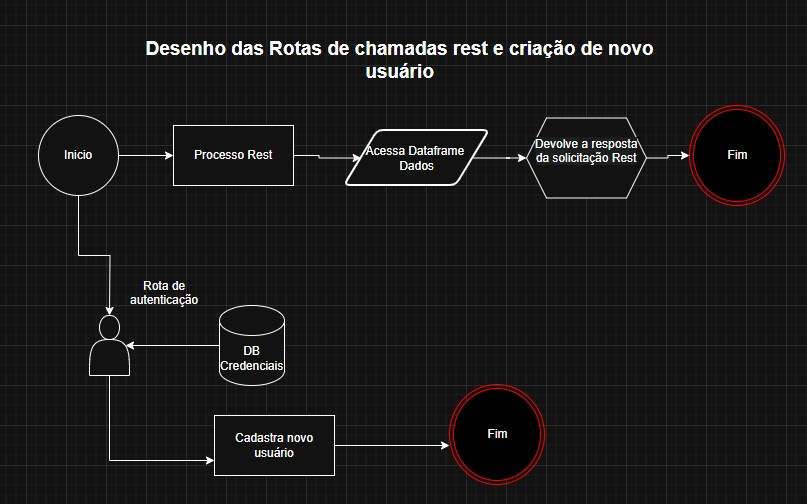

# posTechChalenge
Repositorio TechChalengeFiap

API RESTful para gerenciamento, consulta e análise de livros, com scraping, autenticação JWT, estatísticas, integração com Prometheus, endpoints para Machine Learning e logging estruturado.

---------------------------------------------------------------------------------------------------------------------------------------------------------------------------------------------
## Sumário

- [Sobre o Projeto](#sobre-o-projeto)
- [Funcionalidades](#funcionalidades)
- [Instalação](#instalacao)
- [Configuração](#configuracao)
- [Endpoints Principais](#endpoints-principais)
- [Autenticação JWT](#autenticacao-jwt)
- [Scraping](#scraping)
- [Machine Learning](#machine-learning)
- [Logs](#logs)
- [Monitoramento](#monitoramento)

---------------------------------------------------------------------------------------------------------------------------------------------------------------------------------------------
## Sobre o Projeto

Esta API permite:

Gerenciar e consultar um catálogo de livros.
Realizar scraping de dados de livros.
Autenticar usuários via JWT.
Expor métricas Prometheus.
Fornecer endpoints para análise estatística e Machine Learning.
Registrar logs estruturados em formato NDJSON.

---------------------------------------------------------------------------------------------------------------------------------------------------------------------------------------------

## Funcionalidades

CRUD de livros (via scraping e importação).
Busca por título, categoria e faixa de preço.
Estatísticas gerais e por categoria.
Endpoints para consumo e predição de modelos de Machine Learning.
Autenticação JWT.
Logging estruturado.
Swagger UI para documentação interativa.

---------------------------------------------------------------------------------------------------------------------------------------------------------------------------------------------

## Instalação

Clone o repositório:

bash


```bash
git clone https://github.com/seu-usuario/seu-repo.git
cd seu-repo
Crie um ambiente virtual:

```
Crie um ambiente virtual:

```bash
python3 -m venv venv
source venv/bin/activate
Instale as dependências:
```
Instale as dependências:

```bash

pip install -r requirements.txt
Configure o banco de dados e variáveis de ambiente (ver seção Configuração).
```

``python
def hello():
    print("Olá, mundo!")
``    
**Saída:** ```python def hello(): print("Olá, mundo!")```
Configure o banco de dados e variáveis de ambiente (ver seção Configuração).

---------------------------------------------------------------------------------------------------------------------------------------------------------------------------------------------

## Configuração

Inicialize o banco e rode a aplicação:
```bash
python api.py
```
Acesse a documentação interativa:
http://localhost:5000/apidocs

---------------------------------------------------------------------------------------------------------------------------------------------------------------------------------------------

## Endpoints Principais

Livros
GET /api/v1/books — Lista todos os livros.
GET /api/v1/books/<int:book_idx> — Detalhes de um livro pelo índice.
GET /api/v1/books/search?titulo=...&categoria=... — Busca por título/categoria.
GET /api/v1/categories — Lista todas as categorias.
GET /api/v1/books/price-range?min=10&max=50 — Filtra livros por faixa de preço.
GET /api/v1/books/top-rated — Lista livros com maior rating.

Estatísticas
GET /api/v1/stats/overview — Estatísticas gerais.
GET /api/v1/stats/categories — Estatísticas por categoria.

Scraping
POST /api/v1/scraping/trigger — Dispara scraping (JWT).
GET /api/v1/scraping/status — Consulta status do scraping.

Machine Learning
GET /api/v1/ml/features — Dados prontos para features de ML.
GET /api/v1/ml/training-data — Dados para treinamento.
POST /api/v1/ml/predictions — Predição com modelo ML.

Logs
GET /api/v1/logs — Retorna logs estruturados (NDJSON).

---------------------------------------------------------------------------------------------------------------------------------------------------------------------------------------------

## Autenticação JWT




POST /api/v1/auth/login — Login e obtenção de token JWT.
POST /api/v1/auth/newuser — Criação de novo usuário (JWT).
POST /api/v1/auth/refresh — Renovação do token de acesso.

Exemplo de login:

```bash
curl -X POST http://localhost:5000/api/v1/auth/login \
  -H "Content-Type: application/json" \
  -d '{"username": "admin", "password": "1234"}'
```

---------------------------------------------------------------------------------------------------------------------------------------------------------------------------------------------

## Scraping

O scraping é disparado manualmente ou automaticamente se o CSV não existir.
Status do scraping pode ser consultado via endpoint.

---------------------------------------------------------------------------------------------------------------------------------------------------------------------------------------------

## Machine Learning

O modelo é treinado e carregado automaticamente ao iniciar a API.
Endpoints para features, dados de treino e predição.

---------------------------------------------------------------------------------------------------------------------------------------------------------------------------------------------

## Logs

Os logs de execução são salvos em logsExecucao.json no formato NDJSON (um JSON por linha).
Endpoint /api/v1/logs retorna todos os registros.

---------------------------------------------------------------------------------------------------------------------------------------------------------------------------------------------

## Monitoramento


Métricas Prometheus disponíveis em /metrics.
